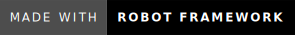

# Robot Framework Activity

[](https://forthebadge.com)
[](https://forthebadge.com)
[](https://forthebadge.com)

<div align="center">
  
</div>

**Robot Framework QA Automation activity** during my CITCO Internship Training.  
It uses **SeleniumLibrary**, Python, and resource files to interact with the [React Admin Demo site](https://marmelab.com/react-admin-demo/).  
If the site is down, you can use the **forked version** available in my repositories.

**Instructor:** Mr. Julius Libao

---

## 🎯 Overview

This suite demonstrates:

- Logging into a sample React Admin app
- Performing customer CRUD operations
- Validating UI data against test data
- Aggregating customer spending

It’s structured like a real-world UI automation project but simplified for training.

---

## 📂 Folder Structure

```text
.
├─ Library/
│  ├─ GetUsersInJSON.py      # Custom Python keywords
│  └─ locators.py            # Centralized locators
├─ Resources/
│  ├─ App.resource           # Common app keywords
│  └─ Customers.resource     # Customer-specific keywords
├─ Results/                  # Test execution outputs (check log.html here)
├─ Tests/
│  └─ Suite.robot            # Main Robot Framework test suite
└─ readme/
   ├─ made-with-python.svg
   ├─ start-date.svg
   ├─ testcase4-passed.mp4   # Test case 4 passing run
   └─ testcase4-failed.mp4   # Test case 4 failing run
```

---

## 🚀 How to Run

1. Create a virtual environment and activate it.

```bash
# macOS / Linux
cd ./project_path
python3 -m venv .venv
source .venv/bin/activate
```

```powershell
# Windows (PowerShell)
cd ./project_path
python -m venv .venv
.\\.venv\\Scripts\\Activate.ps1
```

2. Upgrade pip (optional but recommended).

```bash
pip install --upgrade pip
```

3. Install Robot Framework + SeleniumLibrary and requests.

```bash
pip install robotframework robotframework-seleniumlibrary
pip install requests
```

4. Run the test suite and send output to `Results/`.

```bash
python -m robot -d Results ./Tests/Suite.robot
```

5. Open the results:

- Open `Results/log.html` in your browser to inspect logs and reports.

> Tip: make sure your browser driver (e.g., chromedriver) is installed and matches your browser version. Also, make sure it's added to PATH.

---

## 🧪 Test Cases

| Test Case ID | Description                                                     |
| ------------ | --------------------------------------------------------------- |
| 000001       | Logs in to the demo site and processes first 5 users            |
| 000002       | Replaces rows 6–10 with users 6–10 (simple replace with waits)  |
| 000003       | Iterates all table rows and logs detailed customer information  |
| 000004       | Prints all users’ spending and validates total spending >= 3500 |

> 🎥 Watch `readme/testcase4-passed.mp4` and `readme/testcase4-failed.mp4` to see the suite in action.

---

## ❓ FAQ

**Q1: What app does this test?**  
It automates [https://marmelab.com/react-admin-demo/](https://marmelab.com/react-admin-demo/).  
If the site is down, use the forked version in my repositories.

**Q2: Where are the results?**  
Open `Results/log.html` after running the test suite.

**Q3: Do I need Python knowledge?**  
Basic Python is helpful for the custom keywords in `Library/`, but running the tests only requires Robot Framework installed.

**Q4: Which browser is used?**  
Chrome is default (`${BROWSER} = chrome`) but can be changed in the variables section.

---

## 📜 License

This project is licensed under **AGPL 3.0**.  
Contact `aquino.ylt@gmail.com` if you need a different license.

---

## 🙌 Feedback

If you have comments or requests, email me at [aquino.ylt@gmail.com](mailto:aquino.ylt@gmail.com).

**Fuel future updates – buy me a coffee!**

[](https://buymeacoffee.com/yvanlowellaquino)

### Thank you and God bless!
